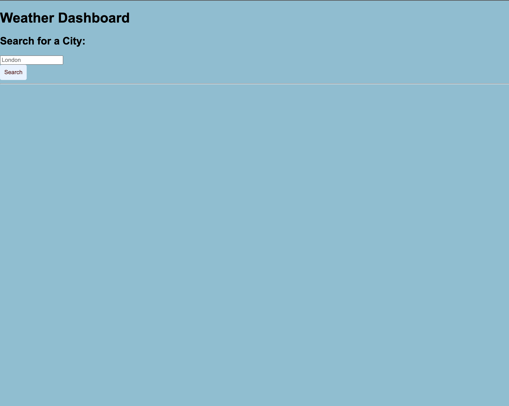
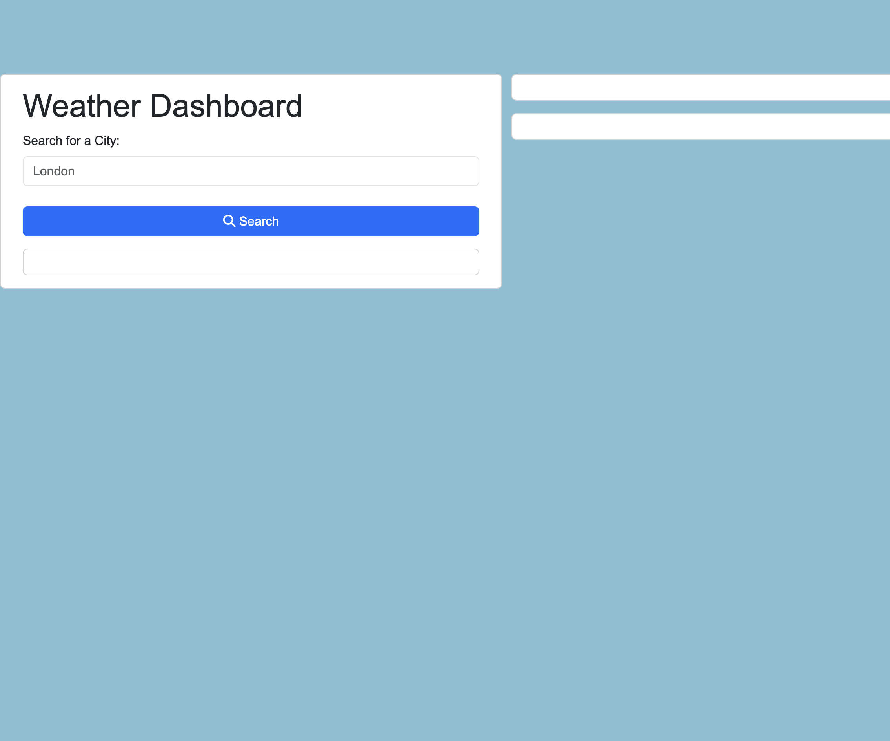
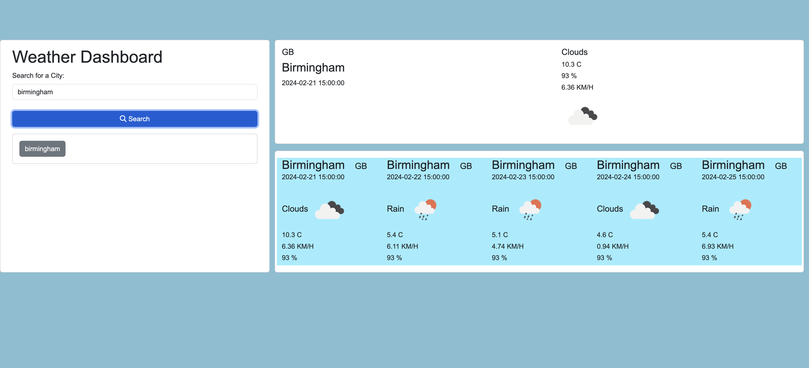

# Weather Dashboard
Eight Challenge for Bootcamp in web-developing and UX

For this task, my objective was to develop a straightforward weather dashboard, incorporating the utilization of the Day.js library for efficient handling of date and time functionalities. The assignment involved creating a basic weather dashboard and implementing the [Day.js](https://day.js.org/docs/en/display/format)  library to manage date and time aspects effectively.

## Acceptance Criteria

* Create a weather dashboard with form inputs.
  * When a user searches for a city they are presented with current and future conditions for that city and that city is added to the search history
  * When a user views the current weather conditions for that city they are presented with:
    * The city name
    * The date
    * An icon representation of weather conditions
    * The temperature
    * The humidity
    * The wind speed
  * When a user view future weather conditions for that city they are presented with a 5-day forecast that displays:
    * The date
    * An icon representation of weather conditions
    * The temperature
    * The humidity
  * When a user click on a city in the search history they are again presented with current and future conditions for that city

# Utilization

 All you need to do is open [this page](https://seyiturbo.github.io/Weatherdashboard/) in your browser. The weather dashboard will be ready for you to use;

md
 

md

md

   

## Credits

These are the materials i consulted for this project:

[day.js](https://day.js.org/docs/en/display/format)

[openweather 5-day forecast API](https://openweathermap.org/forecast5#5days)

[Read Me Guide](https://coding-boot-camp.github.io/full-stack/github/professional-readme-guide)

